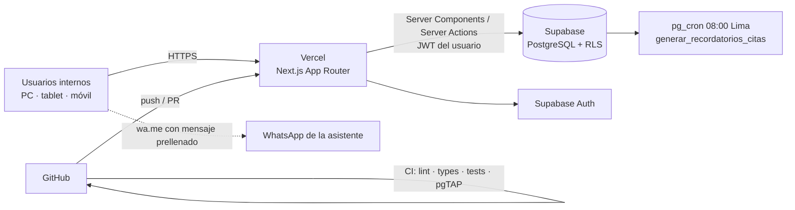

# ARCHITECTURE — Plataforma GynFem

## 1. Vista general



Un solo proyecto (monolito modular). Sin backend separado, sin microservicios.

## 2. Stack y justificación

| Pieza | Uso | Por qué |
|---|---|---|
| Next.js (App Router) + TypeScript | Aplicación completa (UI + lógica de servidor) | Un solo repo y un solo despliegue |
| Tailwind + shadcn/ui | Estilos y componentes | Componentes accesibles, el código queda en el repo |
| Zod + React Hook Form | Validación compartida cliente/servidor | Un esquema, dos usos |
| Supabase Postgres | Datos | SQL real, restricciones, triggers, funciones |
| Supabase Auth | Login, sesiones, MFA | Integrado con RLS vía `auth.uid()` |
| Supabase RLS | Autorización por rol | La seguridad no depende del frontend |
| pg_cron | Tarea diaria de recordatorios | Corre dentro de la BD; sin límites de cron de Vercel Hobby |
| Supabase Storage | Documentos (opcional, Fase 5) | Buckets privados + URLs firmadas |
| Recharts (chart de shadcn) | Gráficos del dashboard | Integrado al sistema de diseño |
| Vercel | Hosting, previews por PR | Deploy automático desde GitHub |
| GitHub + Actions | Código, PRs, CI | Calidad antes del merge |
| v0 | Prototipos de pantallas | Solo para la etapa "Prototipo" de Design Thinking; el repo es la fuente de verdad |

## 3. Decisiones (ADR resumidos)

- **ADR-01 Monolito Next.js.** No FastAPI/Render/microservicios: más piezas sin beneficio para 8 usuarios y ~520 atenciones/mes.
- **ADR-02 RLS como capa de autorización.** Toda lectura/escritura usa el JWT del usuario. La clave secreta solo para administrar usuarios (Auth Admin API) desde el servidor.
- **ADR-03 Roles en `profiles` + función `tiene_rol()`.** `security definer`, cacheada por consulta con `(select ...)` en políticas. El rol inicial viene de `app_metadata` (no editable por el usuario).
- **ADR-04 Separación clínico / administrativo.** `asistente`, `admin` y `soporte` no leen tablas clínicas. El dashboard usa `kpi_resumen()` que devuelve solo agregados.
- **ADR-05 Auditoría por triggers.** Tablas administrativas guardan antes/después; tablas clínicas guardan solo *qué campos* cambiaron (la auditoría no duplica datos clínicos). Lecturas de historia clínica vía `registrar_acceso_historia()`.
- **ADR-06 Sin borrado físico.** Estados (`cancelada`, `cancelado`), inmutabilidad + adendas en atenciones, `deleted_at` solo en pacientes.
- **ADR-07 Recordatorios en dos etapas.** MVP: la BD genera la cola y la asistente envía con un clic (wa.me) → costo cero, sin plantillas de Meta. Año 2: el mismo modelo con canal `whatsapp_api` (WhatsApp Cloud API) mediante Edge Function.
- **ADR-08 Región `sa-east-1` (São Paulo).** Menor latencia desde Perú. Implica flujo transfronterizo de datos personales (Ley 29733): declararlo en el aviso de privacidad y evaluarlo con asesoría legal antes de operar con datos reales.
- **ADR-09 Dos entornos Supabase.** `gynfem-dev` (desarrollo y previews) y `gynfem-prod` (solo cuando haya validación legal). En el plan gratuito caben 2 proyectos.

## 4. Estructura de carpetas

```
src/
  app/
    (auth)/login/page.tsx
    (auth)/cuenta-inactiva/page.tsx
    (app)/layout.tsx                 # sidebar + guard de sesión
    (app)/inicio/page.tsx            # redirige según rol
    (app)/dashboard/page.tsx         # admin, medico, obstetra
    (app)/pacientes/page.tsx
    (app)/pacientes/nuevo/page.tsx
    (app)/pacientes/[id]/page.tsx    # tabs: datos, citas, historia*, seguimientos
    (app)/agenda/page.tsx
    (app)/atenciones/[id]/page.tsx   # medico, obstetra
    (app)/seguimientos/page.tsx
    (app)/recordatorios/page.tsx     # asistente, admin
    (app)/admin/usuarios/page.tsx
    (app)/admin/servicios/page.tsx
    (app)/admin/auditoria/page.tsx
  components/ui/                     # shadcn (no editar a mano salvo necesidad)
  components/layout/                 # sidebar, header, guards
  features/<modulo>/
    schemas.ts                       # Zod
    queries.ts                       # lecturas (server)
    actions.ts                       # server actions
    components/                      # componentes del módulo
    *.test.ts
  lib/
    supabase/client.ts               # navegador
    supabase/server.ts               # server components/actions (cookies)
    supabase/middleware.ts           # refresco de sesión
    supabase/admin.ts                # clave secreta — import "server-only"
    auth/roles.ts                    # tipos de rol, permisos de menú, requireRol()
    fechas.ts                        # helpers America/Lima
  types/database.types.ts            # generado
middleware.ts                        # (o proxy.ts según versión de Next.js)
supabase/
  config.toml
  migrations/
  seed.sql
  tests/*.test.sql                   # pgTAP
tests/e2e/                           # Playwright
```

## 5. Patrones

**Autorización en servidor**
```ts
// lib/auth/roles.ts
export type Rol = Database["public"]["Enums"]["app_rol"];
export async function requireRol(...permitidos: Rol[]) {
  const supabase = await createClient();
  const { data: { user } } = await supabase.auth.getUser();
  if (!user) redirect("/login");
  const { data: perfil } = await supabase.from("profiles").select("rol, activo").eq("id", user.id).single();
  if (!perfil?.activo) redirect("/cuenta-inactiva");
  if (!permitidos.includes(perfil.rol)) notFound();
  return { user, perfil };
}
```
Es una comodidad de UX: aunque falle, RLS sigue bloqueando los datos.

**Server Action**
```ts
"use server";
export async function crearPaciente(input: unknown): Promise<Resultado<{ id: string }>> {
  const parsed = pacienteSchema.safeParse(input);
  if (!parsed.success) return { ok: false, error: "Revisa los campos marcados" };
  const supabase = await createClient();
  const { data, error } = await supabase.from("pacientes").insert(parsed.data).select("id").single();
  if (error?.code === "23505") return { ok: false, error: "Ya existe una paciente con ese documento" };
  if (error) return { ok: false, error: "No se pudo registrar la paciente" };
  revalidatePath("/pacientes");
  return { ok: true, data };
}
```

## 6. Variables de entorno

| Variable | Dónde | Pública |
|---|---|---|
| `NEXT_PUBLIC_SUPABASE_URL` | local, Vercel | Sí |
| `NEXT_PUBLIC_SUPABASE_PUBLISHABLE_KEY` | local, Vercel | Sí (protegida por RLS) |
| `SUPABASE_SECRET_KEY` | local, Vercel (solo servidor) | **No** |
| `NEXT_PUBLIC_SITE_URL` | local, Vercel | Sí |
| `NEXT_PUBLIC_WHATSAPP_SEDE` | local, Vercel | Sí (texto de sede para mensajes) |

Si tu proyecto Supabase muestra claves "legacy", `anon` equivale a la publishable y `service_role` a la secret.

## 7. Entornos y costos

| Entorno | Vercel | Supabase | Costo |
|---|---|---|---|
| Desarrollo / demo académica | Hobby | Free (`gynfem-dev`) | S/ 0 |
| Producción real con pacientes | Pro (el plan Hobby es de uso no comercial) | Pro (backups diarios, sin pausa por inactividad) | ≈ US$ 45/mes — verificar precios vigentes |

Límites a tener presentes en Free: el proyecto Supabase se pausa tras ~7 días sin actividad y no incluye backups automáticos descargables. Aceptable para demo con datos ficticios; **no** para datos reales.
