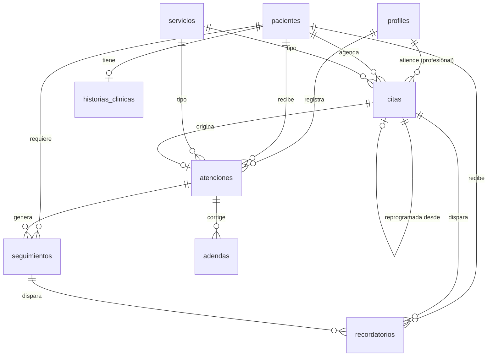

# DATABASE — Modelo de datos y seguridad

Fuente de verdad: `supabase/migrations/20260917000001_esquema_inicial.sql` (validada con Postgres 16 + pgTAP).

## 1. Diagrama entidad-relación



## 2. Tablas

| Tabla | Tipo de dato | Propósito | Borrado |
|---|---|---|---|
| `profiles` | Administrativo | Usuario interno, rol y estado activo | `activo = false` |
| `servicios` | Administrativo | Catálogo (nombre, categoría, duración, precio referencial) | `activo = false` |
| `pacientes` | Personal | Ficha maestra, contacto, consentimiento | `deleted_at` (solo admin) |
| `historias_clinicas` | **Clínico** | Antecedentes gineco-obstétricos (1 por paciente) | No se borra |
| `citas` | Administrativo | Agenda por profesional; sin cruces | estado `cancelada` |
| `atenciones` | **Clínico** | Episodio asistencial; inmutable al firmar | No se borra |
| `adendas` | **Clínico** | Correcciones de atenciones firmadas | No se borra |
| `seguimientos` | Administrativo | Control/resultado/procedimiento pendiente | estado `cancelado` |
| `recordatorios` | Administrativo | Cola de mensajes (sin datos clínicos) | estado `cancelado` |
| `audit_log` | Auditoría | Quién hizo qué y cuándo | No se borra |

## 3. Matriz de permisos (RLS)

S = select · I = insert · U = update. Nadie tiene DELETE.

| Tabla | admin | medico | obstetra | asistente | soporte |
|---|---|---|---|---|---|
| profiles | S U | S | S | S | S |
| servicios | S I U | S | S | S | S |
| pacientes | S I U (+ ve borrados) | S I U | S I U | S I U | — |
| historias_clinicas | — | S I U | S I U | — | — |
| citas | S I U | S I U | S I U | S I U | — |
| atenciones | — | S I · U solo propias en borrador | igual que médico | — | — |
| adendas | — | S I (solo sobre firmadas) | S I | — | — |
| seguimientos | S | S I U | S I U | S U | — |
| recordatorios | S I U | S | S | S I U | — |
| audit_log | S | — | — | — | — |

Usuario con `activo = false`: no ve nada (salvo su propio perfil).
`anon`: sin acceso a ninguna tabla.

## 4. Reglas en la base de datos

| Regla | Mecanismo | Error que verá la app |
|---|---|---|
| Documento único por paciente activa | Índice único parcial | `23505` |
| DNI de 8 dígitos | CHECK | `23514` |
| Consentimiento obligatorio | CHECK | `23514` |
| Sin cruce de citas por profesional | EXCLUDE con `tstzrange` | `23P01` |
| Atención firmada inmutable | Trigger + RLS | Update afecta 0 filas (tratar como error) |
| Al firmar: `firmada_at`, `firmada_por`, cita → `atendida` | Triggers | — |
| Adenda solo sobre atención firmada | Política RLS | `42501` |
| Sin DELETE físico | REVOKE | `42501` |

## 5. Funciones (RPC)

| Función | Quién | Qué hace |
|---|---|---|
| `tiene_rol(...roles)` | uso interno en políticas | ¿usuario activo con alguno de esos roles? |
| `registrar_acceso_historia(p_paciente_id)` | medico, obstetra | Registra lectura `READ` en auditoría |
| `kpi_resumen(p_desde, p_hasta)` | admin, medico, obstetra | JSON con KPI agregados (sin datos identificables) |
| `generar_recordatorios_citas()` | pg_cron, admin, asistente | Crea recordatorios para citas de mañana |

Ejemplo desde Next.js:
```ts
const { data } = await supabase.rpc("kpi_resumen", { p_desde: "2026-09-01", p_hasta: "2026-09-30" });
```

## 6. Auditoría
- Tablas administrativas: guarda fila anterior y nueva (`datos_antes`, `datos_despues`).
- Tablas clínicas: guarda solo `{"campos_modificados": [...]}` para no duplicar información clínica.
- `SOFT_DELETE` se detecta cuando `deleted_at` pasa de nulo a fecha.
- Lecturas de historia clínica: `READ` vía RPC.

## 7. Zona horaria
Todo en `timestamptz` (UTC en BD). Filtros por día y mensajes usan `America/Lima`.

## 8. Pendientes de diseño (decidir en la fase indicada)
- Fase 5: bucket privado `documentos-clinicos` + tabla `documentos` (metadatos) si se requiere adjuntar archivos.
- Fase 7: vista de posibles duplicados por nombre + fecha de nacimiento (KPI-07).
- Producción: plazos de conservación de historias clínicas según normativa vigente.

## 9. MFA (AAL2) en RLS

Desde la Fase 8, `admin`, `medico` y `obstetra` deben completar el segundo factor (TOTP) para
operar. Esto se aplica en tres capas independientes (defensa en profundidad):

1. **Middleware** (`src/proxy.ts` → `src/lib/supabase/middleware.ts`): redirige a `/mfa/activar`
   o `/mfa/verificar` antes de servir cualquier ruta protegida.
2. **`getPerfil()`/`requireRol()`** (`src/lib/auth/guards.ts`): repite la misma verificación.
   Es necesario porque las Server Actions que usan `SUPABASE_SECRET_KEY` (crear usuario, cambiar
   rol, activar/desactivar, restablecer MFA) usan el cliente admin, que **bypasea RLS** — si solo
   el middleware protegiera esto, un fallo o un bypass de middleware dejaría esas acciones
   expuestas con solo aal1.
3. **RLS** (`supabase/migrations/20260919170000_mfa_aal2_auditoria.sql`): `requiere_aal2()` se
   exige en las políticas de `historias_clinicas`, `atenciones`, `adendas`, `audit_log` y en el
   `UPDATE` de `profiles`. Esta es la capa que protege contra un JWT robado con sesión en aal1
   (contraseña filtrada sin el TOTP), acceso directo a la API de Supabase, o un error futuro en
   las capas de aplicación.

`registrar_acceso_historia()` también exige aal2: es el punto donde la app deja constancia de que
alguien abrió la historia clínica, y no tendría sentido que quedara disponible con un nivel de
sesión que la propia política `historias_select` ya rechaza para leer el contenido.

## 10. Enmascarado de auditoría clínica (defensa en profundidad)

El trigger `fn_auditoria('solo_campos')` en `historias_clinicas`, `atenciones` y `adendas` nunca
guardó contenido clínico: solo los nombres de los campos modificados (ADR-05). Desde la Fase 8,
el constraint `audit_log_clinico_enmascarado` lo hace estructuralmente imposible de violar,
incluso si una migración futura crea un trigger de auditoría en una tabla clínica sin el
argumento `'solo_campos'`: cualquier INSERT en `audit_log` con `tabla` clínica y contenido sin
enmascarar es rechazado por la base de datos (`23514`), no solo evitado por convención de código.

## 11. Advertencias del Security Advisor aceptadas

Estas funciones son `SECURITY DEFINER` por diseño (necesitan leer o escribir más allá de lo que
el RLS del invocador permitiría) y el Advisor de Supabase puede señalarlas para revisión manual.
Se aceptan tal cual porque **todas validan el rol del invocador en la primera línea del cuerpo**,
antes de tocar cualquier dato, y ninguna tiene `EXECUTE` otorgado a `anon`:

| Función | Rol exigido internamente | Nota |
|---|---|---|
| `tiene_rol(...)` | — (solo refleja el rol del propio invocador) | Helper de lectura de `profiles`, nunca autoriza nada por sí sola |
| `requiere_aal2()` | — (solo refleja el claim `aal` del propio JWT) | Igual que `tiene_rol`: helper, no autoriza nada |
| `registrar_acceso_historia(uuid)` | `medico`, `obstetra` + aal2 | Deja constancia de lectura de historia clínica |
| `registrar_reset_mfa(uuid)` | `admin` + aal2 | Deja constancia de que un admin restableció el MFA de otro usuario |
| `kpi_resumen(date, date)` | `admin`, `medico`, `obstetra` | Devuelve solo agregados, nunca filas identificables |
| `pacientes_posibles_duplicados()` | `admin` | KPI-07; agrupa por nombre+fecha de nacimiento, no expone historias clínicas |
| `generar_recordatorios_citas(text)` | `admin`, `asistente` (o sin sesión: solo pg_cron) | El `REVOKE`/`GRANT` a nivel de Postgres ya le quita `EXECUTE` a `anon`, así que ni siquiera llega a evaluarse el chequeo de rol si alguien sin sesión intenta invocarla por la API |

`handle_new_user()`, `handle_user_rol_actualizado()`, `fn_auditoria()`, `fn_cita_atendida()`,
`fn_set_updated_at()` y `fn_proteger_atencion()` son funciones de trigger: nunca deben invocarse
directamente. Desde `supabase/migrations/20260919173000_revocar_execute_funciones_trigger.sql`
ninguna tiene `EXECUTE` para `public`, `anon` ni `authenticated` (los triggers las disparan sin
pasar por ese chequeo de privilegio). Ver `supabase/tests/seguridad_funciones_trigger.test.sql`.

**Protección de contraseñas filtradas** (Supabase Auth → Password protection): se activa desde el
dashboard de `gynfem-dev` (no es configurable por migración). Ver `README.md`.
