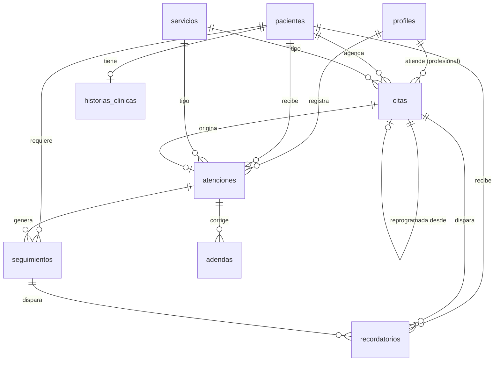

# DATABASE — Modelo de datos y seguridad

Fuente de verdad: `supabase/migrations/20260917000001_esquema_inicial.sql` (validada con Postgres 16 + pgTAP).

## 1. Diagrama entidad-relación



## 2. Tablas

| Tabla | Tipo de dato | Propósito | Borrado |
|---|---|---|---|
| `profiles` | Administrativo | Usuario interno, rol y estado activo | `activo = false` |
| `servicios` | Administrativo | Catálogo (nombre, categoría, duración, precio referencial) | `activo = false` |
| `pacientes` | Personal | Ficha maestra, contacto, consentimiento | `deleted_at` (solo admin) |
| `historias_clinicas` | **Clínico** | Antecedentes gineco-obstétricos (1 por paciente) | No se borra |
| `citas` | Administrativo | Agenda por profesional; sin cruces | estado `cancelada` |
| `atenciones` | **Clínico** | Episodio asistencial; inmutable al firmar | No se borra |
| `adendas` | **Clínico** | Correcciones de atenciones firmadas | No se borra |
| `seguimientos` | Administrativo | Control/resultado/procedimiento pendiente | estado `cancelado` |
| `recordatorios` | Administrativo | Cola de mensajes (sin datos clínicos) | estado `cancelado` |
| `audit_log` | Auditoría | Quién hizo qué y cuándo | No se borra |

## 3. Matriz de permisos (RLS)

S = select · I = insert · U = update. Nadie tiene DELETE.

| Tabla | admin | medico | obstetra | asistente | soporte |
|---|---|---|---|---|---|
| profiles | S U | S | S | S | S |
| servicios | S I U | S | S | S | S |
| pacientes | S I U (+ ve borrados) | S I U | S I U | S I U | — |
| historias_clinicas | — | S I U | S I U | — | — |
| citas | S I U | S I U | S I U | S I U | — |
| atenciones | — | S I · U solo propias en borrador | igual que médico | — | — |
| adendas | — | S I (solo sobre firmadas) | S I | — | — |
| seguimientos | S | S I U | S I U | S U | — |
| recordatorios | S I U | S | S | S I U | — |
| audit_log | S | — | — | — | — |

Usuario con `activo = false`: no ve nada (salvo su propio perfil).
`anon`: sin acceso a ninguna tabla.

## 4. Reglas en la base de datos

| Regla | Mecanismo | Error que verá la app |
|---|---|---|
| Documento único por paciente activa | Índice único parcial | `23505` |
| DNI de 8 dígitos | CHECK | `23514` |
| Consentimiento obligatorio | CHECK | `23514` |
| Sin cruce de citas por profesional | EXCLUDE con `tstzrange` | `23P01` |
| Atención firmada inmutable | Trigger + RLS | Update afecta 0 filas (tratar como error) |
| Al firmar: `firmada_at`, `firmada_por`, cita → `atendida` | Triggers | — |
| Adenda solo sobre atención firmada | Política RLS | `42501` |
| Sin DELETE físico | REVOKE | `42501` |

## 5. Funciones (RPC)

| Función | Quién | Qué hace |
|---|---|---|
| `tiene_rol(...roles)` | uso interno en políticas | ¿usuario activo con alguno de esos roles? |
| `registrar_acceso_historia(p_paciente_id)` | medico, obstetra | Registra lectura `READ` en auditoría |
| `kpi_resumen(p_desde, p_hasta)` | admin, medico, obstetra | JSON con KPI agregados (sin datos identificables) |
| `generar_recordatorios_citas()` | pg_cron, admin, asistente | Crea recordatorios para citas de mañana |

Ejemplo desde Next.js:
```ts
const { data } = await supabase.rpc("kpi_resumen", { p_desde: "2026-09-01", p_hasta: "2026-09-30" });
```

## 6. Auditoría
- Tablas administrativas: guarda fila anterior y nueva (`datos_antes`, `datos_despues`).
- Tablas clínicas: guarda solo `{"campos_modificados": [...]}` para no duplicar información clínica.
- `SOFT_DELETE` se detecta cuando `deleted_at` pasa de nulo a fecha.
- Lecturas de historia clínica: `READ` vía RPC.

## 7. Zona horaria
Todo en `timestamptz` (UTC en BD). Filtros por día y mensajes usan `America/Lima`.

## 8. Pendientes de diseño (decidir en la fase indicada)
- Fase 5: bucket privado `documentos-clinicos` + tabla `documentos` (metadatos) si se requiere adjuntar archivos.
- Fase 7: vista de posibles duplicados por nombre + fecha de nacimiento (KPI-07).
- Producción: plazos de conservación de historias clínicas según normativa vigente.
